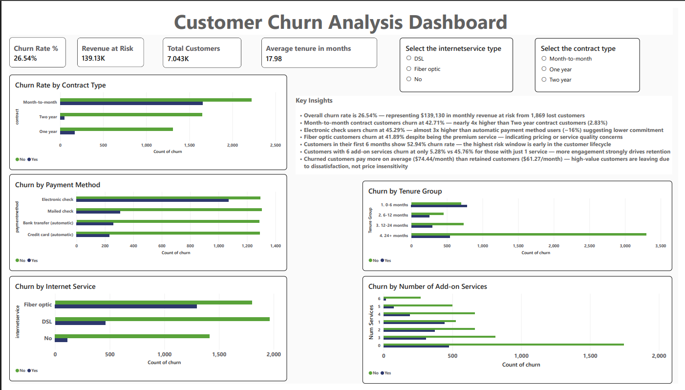

# Customer Churn Analysis & Prediction

## Overview
End-to-end data analysis project analyzing customer churn patterns for a telecom company 
using Python, PostgreSQL, and Power BI. Combines machine learning prediction with 
business intelligence dashboarding to identify at-risk customers and provide actionable 
retention recommendations.

## Tools & Technologies
- **Python** — Data cleaning, EDA, feature engineering, ML modeling
- **PostgreSQL** — Database setup, 10 analytical SQL queries
- **Power BI** — Interactive dashboard with DAX measures
- **Libraries** — Pandas, NumPy, Scikit-learn, Matplotlib, Seaborn

## Dataset
- **Source:** Telco Customer Churn (Kaggle)
- **Size:** 7,043 customers, 21 features
- **Target variable:** Churn (Yes/No)

## Project Structure
```
customer-churn-analysis/
├── data/
│   ├── raw/               # Original dataset
│   └── processed/         # Cleaned dataset
├── notebooks/
│   ├── 01_data_understanding.ipynb
│   ├── 02_data_cleaning_eda.ipynb
│   └── 03_feature_modeling.ipynb
├── sql/
│   └── churn_analysis_queries.sql
├── dashboard/
│   ├── customer-churn-dashboard.pbix
│   └── customer-churn.png
└── README.md
```

## Part 1 — Python Analysis & ML Model

### Data Cleaning
- Fixed TotalCharges column dtype (blank strings → median imputation)
- Handled missing values using median imputation due to right-skewed distribution
- Feature engineering: tenure_group, avg_monthly_spend, num_services_used, 
  auto_payment_flag

### ML Models Trained
| Model | ROC-AUC | Notes |
|-------|---------|-------|
| Logistic Regression | Baseline | Used as reference |
| Gradient Boosting | Best performer | Used SMOTE for class imbalance |
| Random Forest | Good recall | Strong alternative |

**Final model: Gradient Boosting** — selected based on highest recall score 
(minimizing false negatives is critical for churn prediction)

## Part 2 — PostgreSQL Analysis

Loaded cleaned dataset into PostgreSQL and wrote 10 business-focused SQL queries 
covering aggregations, GROUP BY, CTEs, and window functions (RANK + PARTITION BY).

### Key SQL Findings
| Business Question | Finding |
|---|---|
| Overall churn rate | 26.54% (1,869 of 7,043 customers) |
| Highest churn by contract | Month-to-month: 42.71% |
| Lowest churn by contract | Two year: 2.83% |
| Revenue at risk (monthly) | $139,130.85 |
| Highest churn payment method | Electronic check: 45.29% |
| Highest churn internet type | Fiber optic: 41.89% |
| Highest churn tenure bucket | 0-6 months: 52.94% |
| Lowest churn tenure bucket | 24+ months: 14.04% |
| Avg tenure — churned | 18.0 months |
| Avg tenure — retained | 37.6 months |

## Part 3 — Power BI Dashboard

Connected Power BI directly to PostgreSQL database and built an interactive dashboard 
with 4 DAX measures and 5 chart visuals.

### DAX Measures Created
- Churn Rate % = 26.54%
- Revenue at Risk = $139,130
- Total Customers = 7,043
- Avg Churned Tenure = 17.98 months

### Dashboard Visuals
- KPI cards (Churn Rate, Revenue at Risk, Total Customers, Avg Tenure)
- Churn by Contract Type
- Churn by Tenure Group
- Churn by Payment Method
- Churn by Internet Service
- Churn by Number of Add-on Services
- Interactive slicers (Contract Type, Internet Service)

## Key Business Insights

- **26.54% overall churn rate** — representing $139,130 in monthly revenue at risk
- **Month-to-month contracts churn at 42.71%** — nearly 4x higher than Two year 
  contracts (2.83%) — priority retention target
- **Electronic check users churn at 45.29%** — almost 3x higher than automatic payment 
  users (~16%) — nudging customers toward autopay could reduce churn significantly
- **Fiber optic customers churn at 41.89%** despite being the premium service — 
  indicates pricing or service quality concerns worth investigating
- **52.94% churn in first 6 months** — onboarding experience is the highest-risk window
- **Customers with 6 add-on services churn at only 5.28%** vs 45.76% for 1 service — 
  upselling add-ons is a strong retention strategy
- **Churned customers pay more ($74.44/month) than retained ($61.27/month)** — 
  high-value customers are leaving due to dissatisfaction, not price insensitivity

## Business Recommendations

1. **Offer incentives to switch from month-to-month to annual contracts** — biggest 
   single lever to reduce churn (42.71% → 2.83%)
2. **Implement an onboarding retention program for new customers (0-6 months)** — 
   over half of early customers churn
3. **Promote automatic payment methods** — electronic check users churn at 3x the rate 
   of autopay customers
4. **Bundle add-on services in introductory packages** — more services = dramatically 
   lower churn
5. **Investigate fiber optic service quality/pricing** — premium customers churning at 
   high rates signals a product issue

## Dashboard Preview
